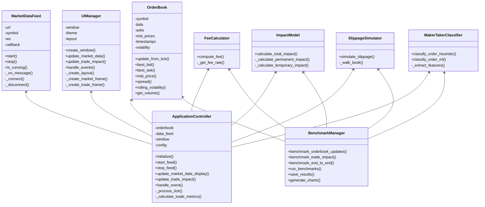
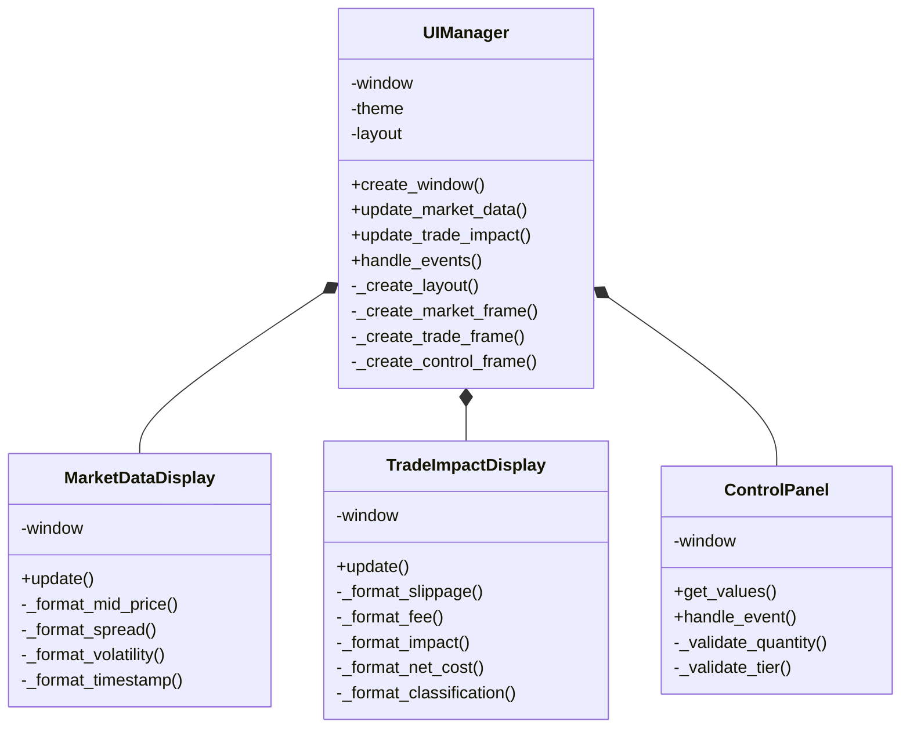
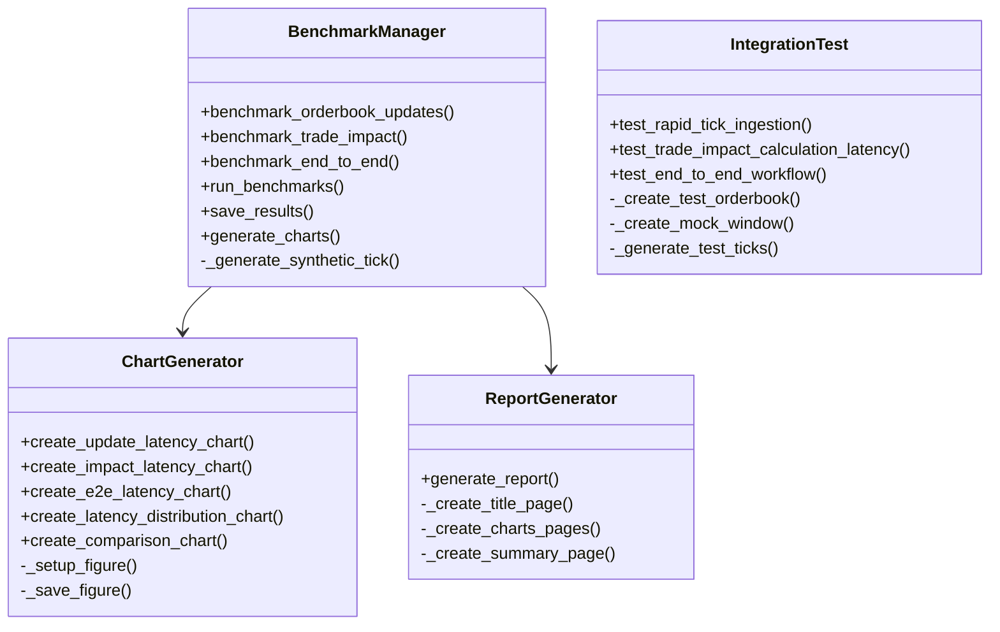

# Trading Simulator Class Diagram

This document provides a class diagram showing the structure and relationships between different components of the trading simulator.

## Main Components

## UI Components

## Benchmark and Testing Components

These class diagrams illustrate the structure and relationships between the different components of the trading simulator, providing a comprehensive view of the system architecture.

The diagrams use Mermaid syntax, which can be rendered by many Markdown viewers including GitHub, GitLab, and various Markdown editors.