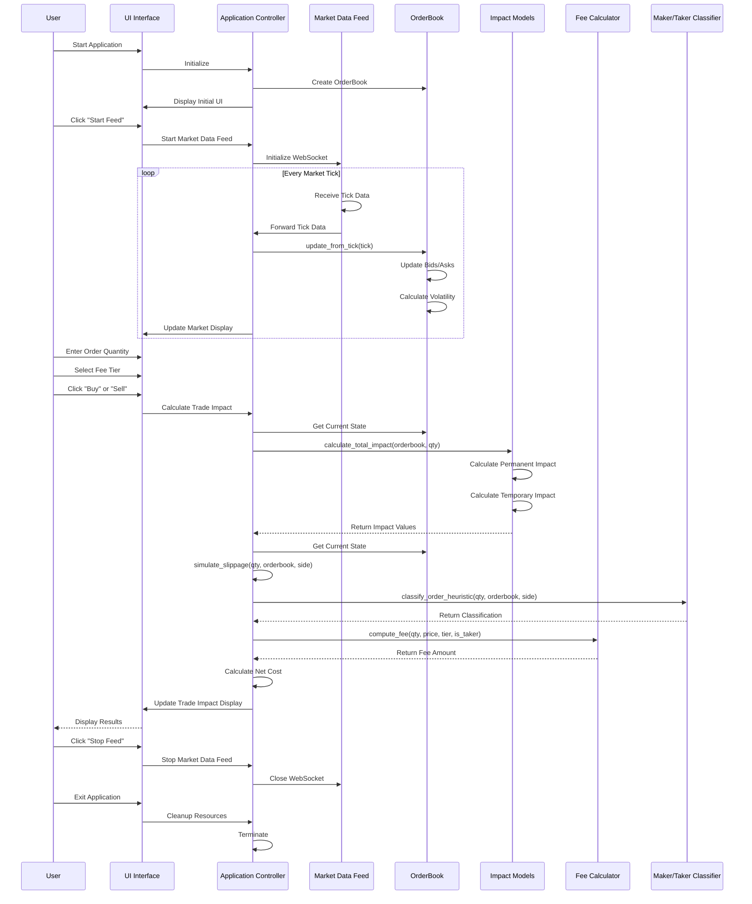
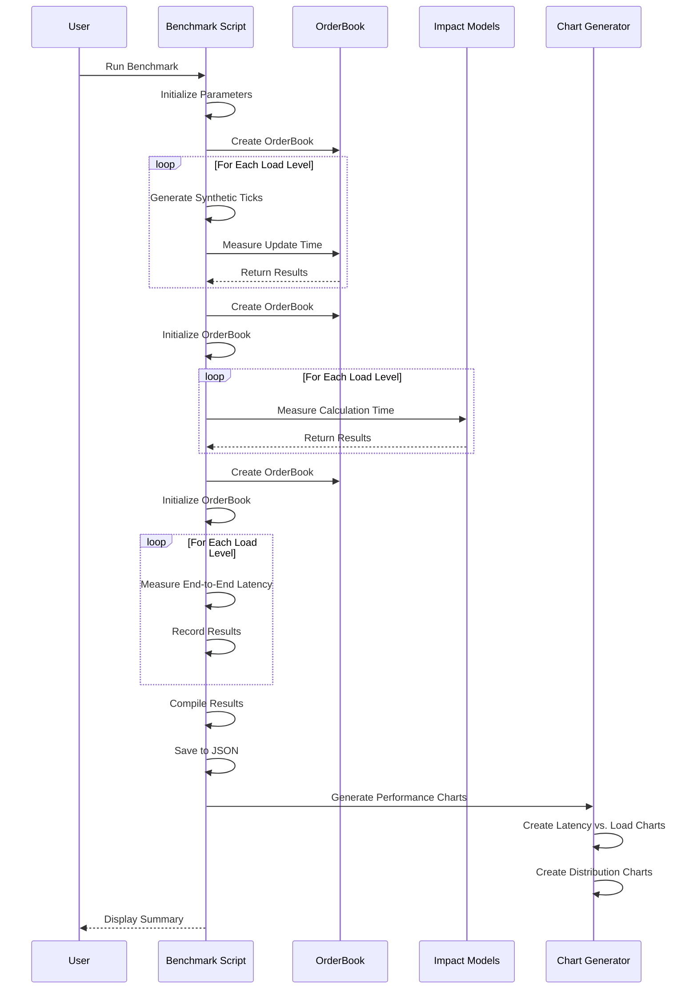
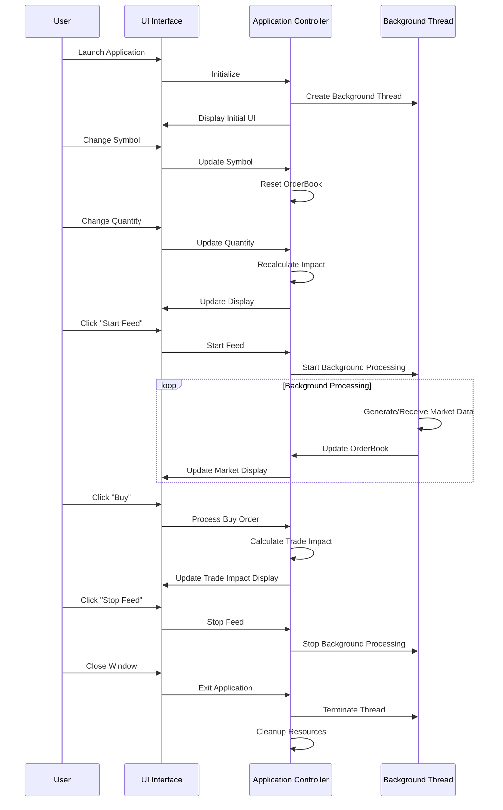
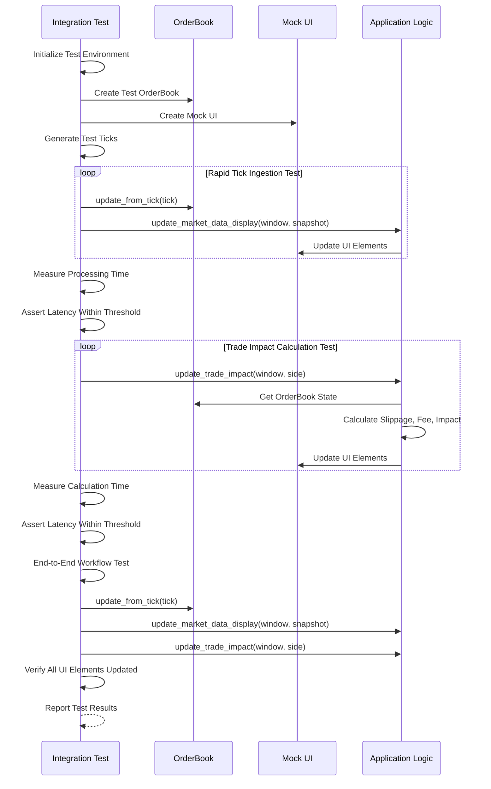

# Trading Simulator Sequence Diagram

This document provides a sequence diagram showing the interaction between different components of the trading simulator.

## Market Data Flow Sequence

## Benchmarking Sequence

## UI Interaction Sequence

## Integration Test Sequence

These sequence diagrams illustrate the key interactions between different components of the trading simulator, including market data flow, benchmarking process, UI interactions, and integration testing.

The diagrams use Mermaid syntax, which can be rendered by many Markdown viewers including GitHub, GitLab, and various Markdown editors.